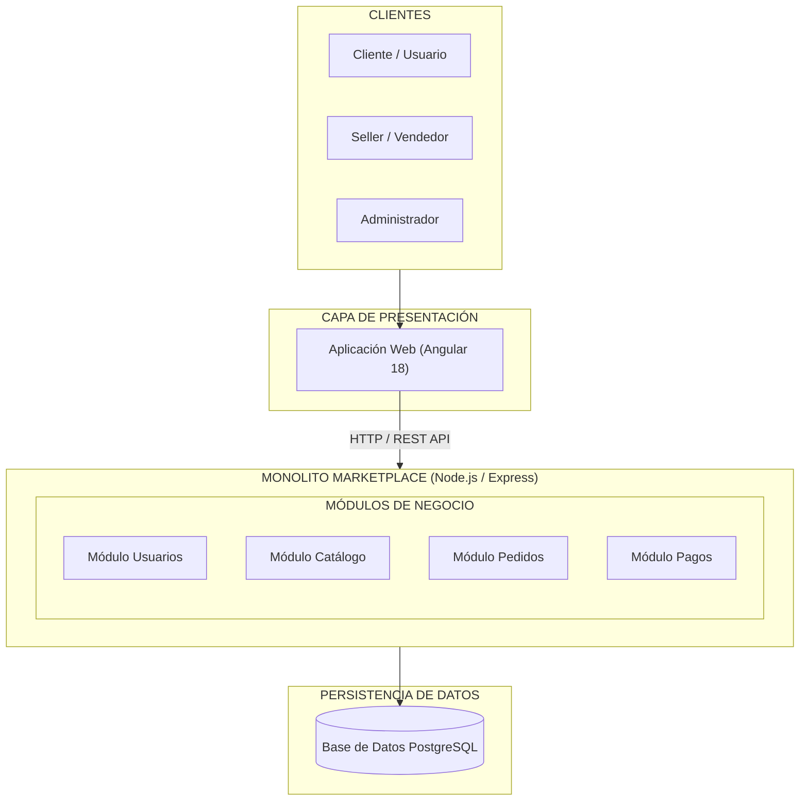

```mermaid
flowchart TD
    subgraph CLIENTES ["CLIENTES"]
        C1["Cliente / Usuario"]
        C2["Seller / Vendedor"]
        C3["Administrador"]
    end

    subgraph PRESENTACION ["CAPA DE PRESENTACIÓN"]
        WEB["Aplicación Web (Angular 18)"]
    end

    subgraph MONOLITO ["MONOLITO MARKETPLACE (Node.js / Express)"]
        subgraph MODULOS ["MÓDULOS DE NEGOCIO"]
            M1["Módulo Usuarios"]
            M2["Módulo Catálogo"]
            M3["Módulo Pedidos"]
            M4["Módulo Pagos"]
        end
    end

    subgraph PERSISTENCIA ["PERSISTENCIA DE DATOS"]
        DB[(Base de Datos PostgreSQL)]
    end

    CLIENTES --> WEB
    WEB -->|"HTTP / REST API"| MONOLITO
    MONOLITO --> DB
```